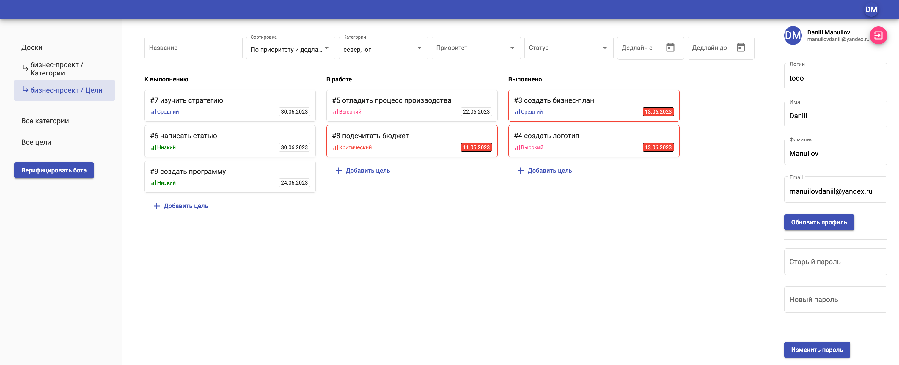
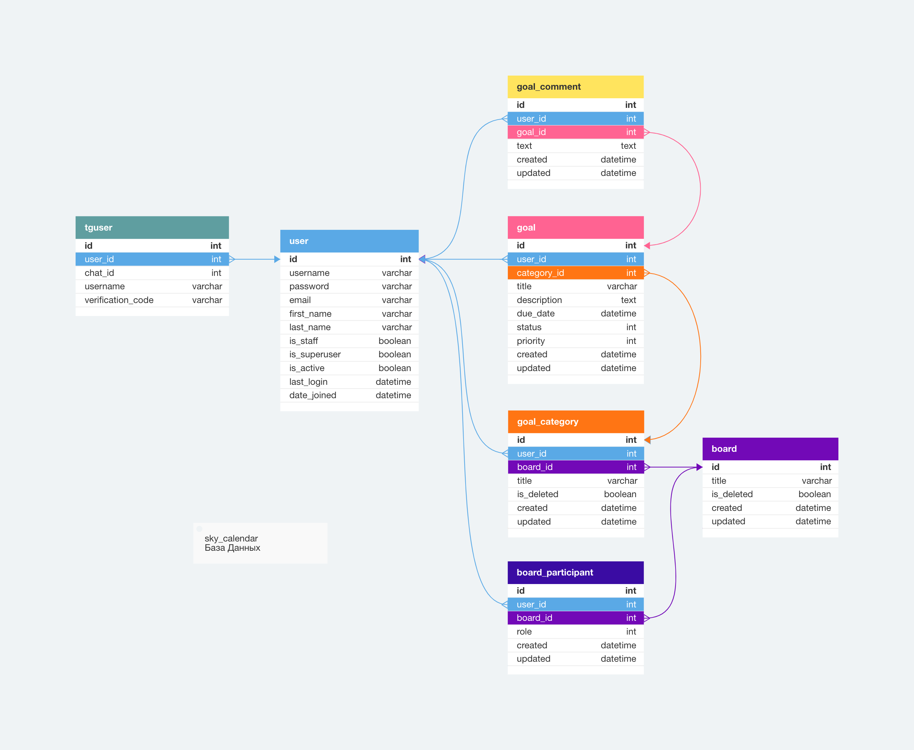
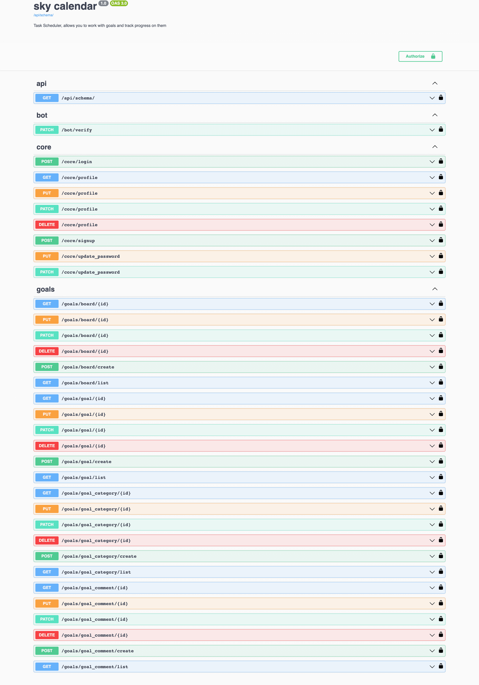

# Календарь

Веб-приложение – планировщик задач, позволяет работать с целями и отслеживать прогресс по ним,
подобно приложениям [todoist](https://todoist.com/), [asana](https://app.asana.com/) и [monday](https://monday.com/).




## Установка и настройка

### Зависимости:

Dependencies указаны в файле pyproject.toml:

* python = "^3.11"
* Django = "^4.2.1"
* django-environ = "^0.10.0"
* psycopg2 = "^2.9.6"
* djangorestframework = "^3.14.0"
* social-auth-app-django = "^5.2.0"
* django-filter = "^23.2"
* pydantic = "^1.10.9"
* requests = "^2.31.0"
* drf-spectacular = "^0.26.2"
* gunicorn = "^20.1.0"

Для работы драйвера "psycopg2" на MacOS должен быть установлен postgresql.

Установите poetry и все зависимости проекта командами:

```sh
pip install poetry && poetry install
```

### Конфигурация

Создайте в корневой папке проекта файл .env по шаблону .env.example, где:

* DEBUG – режим разработчика
* DJANGO_SECRET_KEY – ключ шифрования
* POSTGRES_USER – имя пользователя базы данных postgresql
* POSTGRES_PASSWORD – пароль пользователя базы данных postgresql
* POSTGRES_DB – название базы данных postgresql
* POSTGRES_HOST – хост, где находится база данных postgresql
* ALLOWED_HOSTS – хост, где находится frontend
* VK_OAUTH2_KEY – ID приложения в [https://dev.vk.com/](https://dev.vk.com/api/oauth-parameters)
* VK_OAUTH2_SECRET – защищённый ключ
* TG_TOKEN – токен в [https://core.telegram.org/bots/](https://core.telegram.org/bots/tutorial)


### База данных

В данном проекте используется база данных **PostgreSQL** с таблицами:



Для локальной разработки вам потребуется запустить сервер PostgreSQL. Например, вы можете его запустить командой:

```sh
docker-compose up -d postgres
```

Если вы запускаете его иначе, убедитесь, что указали подключение, соответствующее файлу .env.

Для приведения базы данных в рабочее состояние накатите миграции командой:

```sh
./src/manage.py migrate
```

Для входа в *админку* создайте суперпользователя командой:

```sh
./src/manage.py createsuperuser
```

### Тестирование

Для запуска выполните команду:

```sh
./manage.py test -v 2
```


## Запуск

### Локально

Убедитесь, что база данных запущена и для запуска API выполните команду:

```sh
./src/manage.py runserver
```

После этого API будет доступен по адресу: [http://127.0.0.1:8000/](http://127.0.0.1:8000/)

Для запуска телеграмм бота выполните команду:

```sh
./src/manage.py runbot
```

### Docker

Через docker-compose можно запустить сервис как монолитное приложение,
состоящее из frontend, API, телеграмм бота и PostgreSQL.
Для этого выполните команду:

```sh
docker-compose up -d
```

После этого сайт будет доступен по адресу: [http://127.0.0.1/](http://127.0.0.1/)


## Работа API

API состоит из трёх приложений:

- core: содержит пользователей и авторизацию
- goals: содержит доски, категории, цели и комментарии
- bot: содержит телеграмм-бота

Интерактивная документация swagger доступна по адресу: [http://127.0.0.1:8000/api/schema/swagger-ui/](http://127.0.0.1:8000/api/schema/swagger-ui/)




## Цели проекта

Код написан в учебных целях.


## Лицензия

Этот проект лицензирован в соответствии с условиями лицензии MIT.
